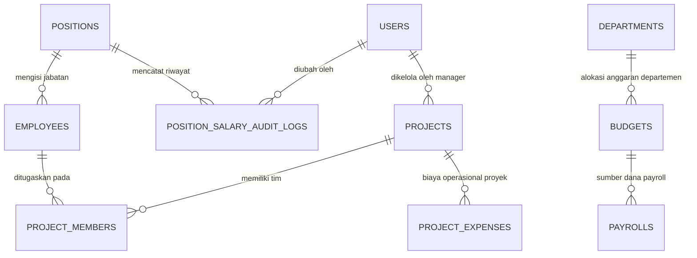

# Rencana Fitur Tambahan: Manajemen Jabatan, Akses Admin, dan Sistem Anggaran (Budgeting)

**PayrollPro - Enterprise Payroll & HR Management System**  
**Versi Dokumen:** 1.0.0  
**Tanggal:** 23 September 2026  
**Status:** Draf Rencana Fitur / Spesifikasi Kebutuhan Teknis (PRD Addendum)  
**Dokumen Terkait:** [PRD-WEB-PAYROLL.md](file:///home/ray/Projects/PayRoll/PRD-WEB-PAYROLL.md), [phases/INDEX.md](file:///home/ray/Projects/PayRoll/phases/INDEX.md)

---

## Daftar Isi
1. [Ringkasan Eksekutif](#1-ringkasan-eksekutif)
2. [Latar Belakang & Tujuan Bisnis](#2-latar-belakang--tujuan-bisnis)
3. [Analisis Kebutuhan Sistem & User Persona](#3-analisis-kebutuhan-sistem--user-persona)
4. [Fitur 1: Standarisasi Jabatan & Struktur Gaji Berjenjang](#4-fitur-1-standarisasi-jabatan--struktur-gaji-berjenjang)
5. [Fitur 2: Manajemen Akses Khusus Admin & Keamanan Ketat (RBAC)](#5-fitur-2-manajemen-akses-khusus-admin--keamanan-ketat-rbac)
6. [Fitur 3: Sistem Anggaran Perusahaan (Corporate Budgeting & Project Costing)](#6-fitur-3-sistem-anggaran-perusahaan-corporate-budgeting--project-costing)
7. [Perancangan Skema Database (Drizzle ORM & PostgreSQL)](#7-perancangan-skema-database-drizzle-orm--postgresql)
8. [Arsitektur API & Rute Endpoint (Microservices & API Gateway)](#8-arsitektur-api--rute-endpoint-microservices--api-gateway)
9. [Perancangan Antarmuka Pengguna (UI/UX Specification)](#9-perancangan-antarmuka-pengguna-uiux-specification)
10. [Rencana Tahapan Pelaksanaan (Implementation Roadmap & Milestones)](#10-rencana-tahapan-pelaksanaan-implementation-roadmap--milestones)
11. [Kriteria Keberhasilan & Strategi Pengujian (Testing & Acceptance Criteria)](#11-kriteria-keberhasilan--strategi-pengujian-testing--acceptance-criteria)

---

## 1. Ringkasan Eksekutif

Dokumen ini memuat rencana spesifikasi dan implementasi dari 3 pilar fitur baru pada ekosistem aplikasi **PayrollPro**:
1. **Struktur Standar Jabatan dengan Skema Gaji Berbeda:** Setiap posisi/jabatan memiliki standar acuan gaji pokok (*base salary*), rentang gaji (*salary grade/tier*), serta tunjangan jabatan yang terikat langsung ke profil karyawan dan perhitungan payroll otomatis.
2. **Restriksi Ketat Modul Jabatan Khusus Admin:** Seluruh aktivitas penambahan (*create*), pengubahan (*edit*), dan penghapusan (*delete*) jabatan serta penetapan nominal gajinya hanya dapat dilakukan oleh Admin (`super_admin` dan `hr_admin`), sedangkan karyawan biasa maupun manajer tidak memiliki wewenang untuk melihat data rahasia skala upah ataupun mengubah data master jabatan.
3. **Sistem Penganggaran (Budgeting System) di Bagian Admin:** Modul kontrol finansial bagi manajemen dan admin untuk merencanakan pagu anggaran (*budget cap*), memantau realisasi pengeluaran (*actual spending*), membagi alokasi antara **Anggaran Gaji/Payroll Rutin**, **Anggaran Proyek (Project-Based Costing)**, serta operasional departemen, lengkap dengan fitur peringatan dini (*early warning / over-budget guardrails*).

---

## 2. Latar Belakang & Tujuan Bisnis

### 2.1 Latar Belakang
- Saat ini data master jabatan pada modul `employee-service` dan tabel `positions` telah memiliki field dasar nama jabatan dan acuan gaji pokok, namun belum terintegrasi secara komprehensif dengan penguncian hak akses, jenjang karir (*salary grade levels*), rentang upah (*min-mid-max*), dan tunjangan jabatan.
- Proses penetapan gaji karyawan saat input data masih rawan inkonsistensi jika tidak dipandu oleh pedoman struktur skala upah resmi perusahaan.
- Perusahaan membutuhkan visibilitas arus kas (*cash flow visibility*) antara biaya pengeluaran gaji rutin per departemen dengan biaya sumber daya (*resource labor cost*) yang dialokasikan ke proyek-proyek spesifik. Ketiadaan kontrol anggaran sering kali menyebabkan biaya proyek membengkak tanpa terdeteksi sejak dini.

### 2.2 Tujuan Bisnis
- **Keadilan & Standarisasi Upah:** Menciptakan transparansi internal dalam jenjang kepangkatan dan standarisasi upah sesuai tanggung jawab jabatan.
- **Integritas & Keamanan Finansial:** Mencegah manipulasi data kompensasi dengan membatasi otoritas hanya pada pimpinan dan administrator terverifikasi melalui audit trail.
- **Efisiensi Pengendalian Anggaran (Cost Control):** Memberikan kendali penuh kepada manajemen untuk memonitor rasio anggaran vs realisasi (*Budget vs Actual*) secara *real-time*, baik untuk penggajian bulanan maupun alokasi biaya per proyek klien.

---

## 3. Analisis Kebutuhan Sistem & User Persona

| Persona | Peran (Role) | Kebutuhan Utama |
| :--- | :--- | :--- |
| **Direksi / Finance Director** | `super_admin` | Menetapkan pagu anggaran tahunan/bulanan, memantau *burn rate* biaya gaji vs proyek, melihat audit trail perubahan nominal gaji. |
| **HR Administrator** | `hr_admin` | Mengelola daftar jabatan, grade level, standar gaji pokok, dan menetapkan anggota tim pada proyek. Memastikan proses payroll tidak *over-budget*. |
| **Project Manager** | `manager` | Melihat sisa kuota anggaran proyek yang sedang dipimpin, memantau utilisasi jam kerja tim terhadap budget proyek (tanpa melihat nominal gaji rahasia individu karyawan). |
| **Staff Karyawan** | `employee` | Hanya melihat jabatan dirinya sendiri pada kartu profil dan slip gaji pribadi; dilarang mengakses modul jabatan dan anggaran. |

---

## 4. Fitur 1: Standarisasi Jabatan & Struktur Gaji Berjenjang

### 4.1 Deskripsi Fitur
Setiap jabatan di dalam perusahaan memiliki profil kompensasi standar yang mencakup:
- **Nama Jabatan** (*Position Title*): Contoh: *Software Engineer, Product Manager, Account Executive*.
- **Tingkat Jenjang** (*Career Grade*): Contoh: *Grade 1 (Junior), Grade 2 (Middle), Grade 3 (Senior), Grade 4 (Lead/Principal), Grade 5 (Manager)*.
- **Gaji Pokok Acuan** (*Base Salary*): Nilai standar gaji bulanan.
- **Rentang Gaji** (*Salary Band / Min - Max*): Batas minimum dan maksimum gaji yang dapat dinegosiasikan untuk posisi tersebut.
- **Tunjangan Jabatan Tetap** (*Position Allowance*): Tunjangan fungsional yang otomatis masuk ke komponen pendapatan karyawan pemegang jabatan tersebut.
- **Deskripsi & Kualifikasi**: Uraian tanggung jawab dan keahlian minimum.

### 4.2 Alur Bisnis (Business Flow)
1. **Penetapan Jabatan oleh Admin:** Admin membuka menu *Pengaturan > Jabatan & Posisi* (`/settings/positions`), membuat jabatan baru dengan memasukkan nama, grade, standar gaji pokok, rentang gaji, dan tunjangan.
2. **Penerapan Saat Penambahan / Mutasi Karyawan:**
   - Pada form *Tambah Karyawan* (`/employees/add`) atau form *Edit Karyawan*, ketika HR Admin memilih dropdown **Jabatan**, sistem secara otomatis mengisi (*auto-populate*) nilai **Gaji Pokok** dan **Tunjangan Jabatan**.
   - Jika HR Admin memasukkan angka manual di luar batas rentang minimum/maksimum jabatan, sistem menampilkan peringatan konfirmasi (*Salary Band Out of Range Warning*).
3. **Integrasi ke Pemrosesan Payroll:**
   - Saat modul payroll (`payroll-service`) memproses penggajian bulanan, komponen gaji pokok dan tunjangan jabatan dibaca langsung dari data jabatan aktif yang bersangkutan.

---

## 5. Fitur 2: Manajemen Akses Khusus Admin & Keamanan Ketat (RBAC)

### 5.1 Matriks Hak Akses (Role-Based Access Control)

| Modul / Tindakan | `super_admin` | `hr_admin` | `manager` | `employee` |
| :--- | :---: | :---: | :---: | :---: |
| **Lihat Daftar Jabatan Lengkap + Skala Gaji** | ✅ Ya | ✅ Ya | ❌ Tidak | ❌ Tidak |
| **Lihat Dropdown Nama Jabatan Saja** (tanpa gaji) | ✅ Ya | ✅ Ya | ✅ Ya (filter) | ❌ Tidak |
| **Tambah Jabatan Baru** (`POST /api/positions`) | ✅ Ya | ✅ Ya | ❌ Tolak (403) | ❌ Tolak (403) |
| **Edit Jabatan & Nominal Gaji** (`PUT /api/positions/:id`) | ✅ Ya | ✅ Ya | ❌ Tolak (403) | ❌ Tolak (403) |
| **Hapus Jabatan** (`DELETE /api/positions/:id`) | ✅ Ya | ✅ Ya (validasi relasi) | ❌ Tolak (403) | ❌ Tolak (403) |
| **Lihat Modul Anggaran & Dashboard Finansial** | ✅ Ya (Penuh) | ✅ Ya (Operasional) | ⚠️ Terbatas (Proyek Sendiri) | ❌ Tolak (403) |
| **Buat / Edit Alokasi Anggaran** | ✅ Ya | ✅ Ya | ❌ Tolak (403) | ❌ Tolak (403) |

### 5.2 Mekanisme Keamanan Sistem
1. **Backend Verification (Fastify & API Gateway):**
   - Middleware `requireRole('super_admin', 'hr_admin')` diterapkan secara mutlak pada seluruh rute mutasi (`POST`, `PUT`, `DELETE`) di `/api/positions` dan `/api/budgets`.
   - Endpoint publik/karyawan yang membutuhkan referensi jabatan hanya menerima `id`, `name`, dan `departmentId` (field sensitif `baseSalary`, `minSalary`, `maxSalary`, `allowance` difilter keluar/dihapus dari response).
2. **Frontend Route Protection:**
   - Navigasi menu *Pengaturan Jabatan* dan *Menu Anggaran* pada `Sidebar.tsx` hanya dirender jika `user.role` termasuk dalam grup Admin yang diizinkan.
   - Pengecekan *guard* pada level halaman via Next.js client router: jika pengguna non-admin mencoba mengakses URL langsung, sistem segera mengarahkan ke `/dashboard` dengan pesan peringatan penolakan akses.
3. **Audit Trail Pencatatan Perubahan (Audit Logging):**
   - Setiap mutasi pada nominal gaji jabatan disimpan ke tabel `position_salary_audit_logs` (merekam: waktu, ID admin yang mengubah, nilai lama, nilai baru, dan alasan perubahan).

---

## 6. Fitur 3: Sistem Anggaran Perusahaan (Corporate Budgeting & Project Costing)

Fitur ini ditempatkan pada panel Admin pada menu navigasi utama: **"Anggaran & Proyek" (`/admin/budgets` atau `/finances/budgets`)**.

```
┌────────────────────────────────────────────────────────────────────────┐
│                      SISTEM ANGGARAN PERUSAHAAN                        │
├───────────────────────────────────┬────────────────────────────────────┤
│     1. ANGGARAN GAJI (PAYROLL)    │     2. ANGGARAN PROYEK (PROJECT)   │
│ • Pagu Gaji Pokok Rutin Bulanan   │ • Alokasi Budget per Klien/Project │
│ • Anggaran Lembur (Overtime Cap)  │ • Alokasi Tim (Labor Costing)      │
│ • Anggaran BPJS & Tunjangan       │ • Pengeluaran Operasional Proyek   │
│ • Anggaran Bonus & THR            │ • Burn Rate & Sisa Anggaran Proyek │
├───────────────────────────────────┴────────────────────────────────────┤
│                     3. MONITORING & EARLY WARNING                      │
│ • Indikator Warna Status Penyerapan: Hijau (<75%), Kuning (75-90%),    │
│   Oranye (90-99%), Merah (Overbudget ≥ 100%)                           │
│ • Pencegahan / Konfirmasi Pembayaran Payroll jika Melebihi Anggaran    │
│ • Rekapitulasi Realisasi vs Anggaran (Bulanan / Kuartalan / Tahunan)   │
└────────────────────────────────────────────────────────────────────────┘
```

### 6.1 Pos Anggaran Utama
1. **Anggaran Penggajian & Remunerasi (Payroll Budget Pool):**
   - **Tipe:** Rutin per periode (Tahun Finansial / Bulan).
   - **Komponen yang Dikelola:**
     - Kuota Biaya Gaji Pokok (*Base Salary Pool*)
     - Kuota Uang Lembur (*Overtime Expense Pool*)
     - Kuota Beban Iuran Perusahaan BPJS Ketenagakerjaan & Kesehatan
     - Kuota Tunjangan Hari Raya (THR) dan Insentif/Bonus Tahunan
   - **Segmentasi:** Dapat ditetapkan secara global seluruh perusahaan atau dipecah per departemen (*IT, Sales, Operasional, HR, Keuangan*).

2. **Anggaran Proyek (Project-Based Budget Pool):**
   - **Tipe:** Berdasarkan masa aktif proyek (*Project Lifecycle*).
   - **Parameter Proyek:** Nama Proyek, Kode Proyek, Klien, Tanggal Mulai, Tanggal Selesai, Total Nilai Pagu Proyek (*Contract/Budget Cap*).
   - **Pembebanan Biaya Tenaga Kerja (Labor Cost Allocation):**
     - Karyawan yang ditugaskan ke proyek dialokasikan dengan bobot jam atau persentase waktu (*FTE - Full Time Equivalent*, contoh: 50% di Project A, 50% di Project B).
     - Sistem secara otomatis menghitung porsi gaji pokok karyawan tersebut yang dibebankan ke pos anggaran proyek terkait setiap kali payroll bulanan dijalankan.
   - **Biaya Langsung Proyek (Direct Project Expenses):**
     - Pembelian lisensi software/server cloud khusus, biaya perjalanan dinas/akomodasi, vendor pihak ketiga, dan konsumsi rapat proyek.

3. **Anggaran Operasional & Pengembangan Departemen (Overhead & OPEX):**
   - Pelatihan (*training/certification*), rekrutmen karyawan baru, pengadaan perangkat kerja (*laptop/hardware*).

### 6.2 Mekanisme Pelacakan & Peringatan (Tracking & Guardrails)
- **Kalkulasi Real-Time:**
  $$\text{Sisa Anggaran} = \text{Alokasi Anggaran} - (\text{Realisasi Payroll Terbayar} + \text{Biaya Proyek Terverifikasi})$$
- **Tingkatan Peringatan (Alert Thresholds):**
  - **Aman (Hijau):** Penyerapan anggaran $< 75\%$
  - **Perhatian (Kuning):** Penyerapan anggaran berada di antara $75\% - 89\%$
  - **Waspada (Oranye):** Penyerapan anggaran mencapai $90\% - 99\%$
  - **Kritis / Overbudget (Merah):** Penyerapan mencapai $\ge 100\%$
- **Overbudget Prevention Workflow:**
  - Saat HR Admin mengklik tombol *Proses Payroll* (`/payroll/process`), sistem mengecek ketersediaan anggaran pada pos gaji periode tersebut.
  - Jika total kalkulasi gaji melebihi pagu anggaran yang disetujui, muncul dialog peringatan: *"Total Payroll melebihi sisa anggaran sebesar Rp XX.XXX.XXX. Diperlukan persetujuan otorisasi dari Super Admin / Direktur Keuangan untuk melanjutkan pemrosesan."*

---

## 7. Perancangan Skema Database (Drizzle ORM & PostgreSQL)

Semua skema didefinisikan pada direktori `packages/db/src/schema/`.

### 7.1 Pembaruan Tabel `positions` (`packages/db/src/schema/positions.ts`)

```typescript
import { pgTable, uuid, varchar, text, decimal, timestamp, integer } from 'drizzle-orm/pg-core';

export const positions = pgTable('positions', {
  id: uuid('id').defaultRandom().primaryKey(),
  name: varchar('name', { length: 100 }).notNull(),
  code: varchar('code', { length: 20 }).unique(), // Misal: SE-SR, PM-LEAD
  description: text('description'),
  grade: varchar('grade', { length: 10 }), // Misal: 'Grade 1', 'Grade 2'
  levelRank: integer('level_rank').default(1), // Level hierarki karir (1: Staff, 2: Senior, 3: Lead, 4: Manager)
  baseSalary: decimal('base_salary', { precision: 15, scale: 2 }).notNull(), // Standar acuan
  minSalary: decimal('min_salary', { precision: 15, scale: 2 }), // Rentang batas bawah
  maxSalary: decimal('max_salary', { precision: 15, scale: 2 }), // Rentang batas atas
  positionAllowance: decimal('position_allowance', { precision: 15, scale: 2 }).default('0.00'), // Tunjangan jabatan
  createdAt: timestamp('created_at').defaultNow(),
  updatedAt: timestamp('updated_at').defaultNow(),
});
```

### 7.2 Tabel Baru: Audit Trail Gaji Jabatan (`position_salary_audit_logs.ts`)

```typescript
import { pgTable, uuid, varchar, decimal, text, timestamp } from 'drizzle-orm/pg-core';
import { positions } from './positions';
import { users } from './users';

export const positionSalaryAuditLogs = pgTable('position_salary_audit_logs', {
  id: uuid('id').defaultRandom().primaryKey(),
  positionId: uuid('position_id').references(() => positions.id, { onDelete: 'cascade' }).notNull(),
  changedByUserId: uuid('changed_by_user_id').references(() => users.id).notNull(),
  oldBaseSalary: decimal('old_base_salary', { precision: 15, scale: 2 }).notNull(),
  newBaseSalary: decimal('new_base_salary', { precision: 15, scale: 2 }).notNull(),
  oldAllowance: decimal('old_allowance', { precision: 15, scale: 2 }),
  newAllowance: decimal('new_allowance', { precision: 15, scale: 2 }),
  reason: text('reason').notNull(),
  createdAt: timestamp('created_at').defaultNow(),
});
```

### 7.3 Tabel Baru: Pagu Anggaran Perusahaan (`budgets.ts`)

```typescript
import { pgTable, uuid, varchar, text, decimal, integer, timestamp } from 'drizzle-orm/pg-core';
import { departments } from './departments';

export const budgets = pgTable('budgets', {
  id: uuid('id').defaultRandom().primaryKey(),
  name: varchar('name', { length: 150 }).notNull(), // Misal: "Anggaran Operasional & Gaji 2026"
  periodYear: integer('period_year').notNull(), // Contoh: 2026
  periodMonth: integer('period_month'), // Null jika tahunan, 1-12 jika bulanan
  category: varchar('category', { length: 30 }).notNull(), // 'payroll', 'project', 'department', 'general'
  departmentId: uuid('department_id').references(() => departments.id), // Opsional (jika per departemen)
  allocatedAmount: decimal('allocated_amount', { precision: 15, scale: 2 }).notNull(), // Pagu anggaran
  spentAmount: decimal('spent_amount', { precision: 15, scale: 2 }).default('0.00').notNull(), // Realisasi terpakai
  notes: text('notes'),
  status: varchar('status', { length: 20 }).default('active'), // 'draft', 'active', 'closed', 'exceeded'
  createdAt: timestamp('created_at').defaultNow(),
  updatedAt: timestamp('updated_at').defaultNow(),
});
```

### 7.4 Tabel Baru: Manajemen Proyek (`projects.ts`)

```typescript
import { pgTable, uuid, varchar, text, decimal, date, timestamp } from 'drizzle-orm/pg-core';
import { users } from './users';

export const projects = pgTable('projects', {
  id: uuid('id').defaultRandom().primaryKey(),
  code: varchar('code', { length: 50 }).unique().notNull(), // Misal: "PRJ-2026-001"
  name: varchar('name', { length: 200 }).notNull(), // Misal: "Pembangunan Portal E-Gov"
  clientName: varchar('client_name', { length: 150 }),
  managerUserId: uuid('manager_user_id').references(() => users.id),
  totalBudget: decimal('total_budget', { precision: 15, scale: 2 }).notNull(), // Total pagu anggaran proyek
  laborBudget: decimal('labor_budget', { precision: 15, scale: 2 }).default('0.00'), // Porsi budget khusus tenaga kerja
  operationalBudget: decimal('operational_budget', { precision: 15, scale: 2 }).default('0.00'), // Porsi budget operasional
  spentLabor: decimal('spent_labor', { precision: 15, scale: 2 }).default('0.00'), // Realisasi tenaga kerja
  spentOperational: decimal('spent_operational', { precision: 15, scale: 2 }).default('0.00'), // Realisasi operasional
  startDate: date('start_date').notNull(),
  endDate: date('end_date'),
  status: varchar('status', { length: 20 }).default('active'), // 'planning', 'active', 'completed', 'on_hold'
  createdAt: timestamp('created_at').defaultNow(),
  updatedAt: timestamp('updated_at').defaultNow(),
});
```

### 7.5 Tabel Baru: Alokasi Anggota Tim Proyek (`project_members.ts`)

```typescript
import { pgTable, uuid, decimal, date, varchar, timestamp } from 'drizzle-orm/pg-core';
import { projects } from './projects';
import { employees } from './employees';

export const projectMembers = pgTable('project_members', {
  id: uuid('id').defaultRandom().primaryKey(),
  projectId: uuid('project_id').references(() => projects.id, { onDelete: 'cascade' }).notNull(),
  employeeId: uuid('employee_id').references(() => employees.id, { onDelete: 'cascade' }).notNull(),
  roleInProject: varchar('role_in_project', { length: 100 }).notNull(), // Misal: "Lead Developer"
  allocationPercentage: decimal('allocation_percentage', { precision: 5, scale: 2 }).default('100.00'), // Contoh: 50.00%
  assignedMonthlyCost: decimal('assigned_monthly_cost', { precision: 15, scale: 2 }).notNull(), // Beban gaji bulanan yang dialokasikan ke proyek
  startDate: date('start_date').notNull(),
  endDate: date('end_date'),
  createdAt: timestamp('created_at').defaultNow(),
});
```

### 7.6 Tabel Baru: Beban Biaya Non-Gaji Proyek (`project_expenses.ts`)

```typescript
import { pgTable, uuid, varchar, text, decimal, date, timestamp } from 'drizzle-orm/pg-core';
import { projects } from './projects';
import { users } from './users';

export const projectExpenses = pgTable('project_expenses', {
  id: uuid('id').defaultRandom().primaryKey(),
  projectId: uuid('project_id').references(() => projects.id, { onDelete: 'cascade' }).notNull(),
  expenseTitle: varchar('expense_title', { length: 200 }).notNull(),
  category: varchar('category', { length: 50 }).notNull(), // 'cloud_server', 'license', 'travel', 'equipment', 'other'
  amount: decimal('amount', { precision: 15, scale: 2 }).notNull(),
  expenseDate: date('expense_date').notNull(),
  receiptUrl: text('receipt_url'),
  submittedByUserId: uuid('submitted_by_user_id').references(() => users.id).notNull(),
  status: varchar('status', { length: 20 }).default('approved'), // 'pending', 'approved', 'rejected'
  createdAt: timestamp('created_at').defaultNow(),
});
```

### 7.7 Entity Relationship Diagram (ERD)



---

## 8. Arsitektur API & Rute Endpoint (Microservices & API Gateway)

### 8.1 Modul Jabatan (`employee-service` melalui API Gateway `/api/positions`)

| Method | Endpoint | Hak Akses | Deskripsi |
| :--- | :--- | :--- | :--- |
| `GET` | `/api/positions` | Semua User Login | Mengambil daftar jabatan (Non-admin hanya menerima nama, grade, dan ID; admin menerima skala gaji lengkap). |
| `GET` | `/api/positions/:id` | Semua User Login | Detail posisi. |
| `POST` | `/api/positions` | `super_admin`, `hr_admin` | Menambah jabatan baru beserta rincian standar gaji & tunjangan. |
| `PUT` | `/api/positions/:id` | `super_admin`, `hr_admin` | Mengubah data jabatan & skala gaji (merekam ke audit log). |
| `DELETE` | `/api/positions/:id` | `super_admin`, `hr_admin` | Menghapus jabatan jika tidak ada karyawan aktif yang terikat. |
| `GET` | `/api/positions/:id/audit-logs` | `super_admin` | Melihat riwayat perubahan gaji jabatan. |

### 8.2 Modul Anggaran & Proyek (`payroll-service` melalui API Gateway `/api/budgets` & `/api/projects`)

| Method | Endpoint | Hak Akses | Deskripsi |
| :--- | :--- | :--- | :--- |
| `GET` | `/api/budgets/summary` | `super_admin`, `hr_admin` | Ringkasan eksekutif anggaran: Total Pagu, Realisasi Gaji, Realisasi Proyek, Sisa Saldo. |
| `GET` | `/api/budgets` | `super_admin`, `hr_admin` | Daftar alokasi anggaran (filter per tahun/bulan/kategori). |
| `POST` | `/api/budgets` | `super_admin` | Menetapkan alokasi pagu anggaran baru. |
| `PUT` | `/api/budgets/:id` | `super_admin` | Menyesuaikan/merevisi alokasi pagu anggaran. |
| `GET` | `/api/projects` | `super_admin`, `hr_admin`, `manager` | Daftar seluruh proyek beserta status penyerapan anggaran. |
| `POST` | `/api/projects` | `super_admin`, `hr_admin` | Membuat proyek baru & menetapkan alokasi budget. |
| `GET` | `/api/projects/:id` | `super_admin`, `hr_admin`, `manager` | Detail proyek, sisa budget, daftar anggota tim, pengeluaran. |
| `POST` | `/api/projects/:id/members` | `super_admin`, `hr_admin` | Menugaskan karyawan ke proyek dengan porsi alokasi biaya gaji. |
| `DELETE` | `/api/projects/:id/members/:memberId`| `super_admin`, `hr_admin` | Melepas karyawan dari penugasan proyek. |
| `POST` | `/api/projects/:id/expenses` | `super_admin`, `hr_admin`, `manager` | Mencatat beban biaya operasional langsung proyek. |
| `GET` | `/api/budgets/check-payroll` | `super_admin`, `hr_admin` | Pre-check validasi sebelum proses payroll: mendeteksi potensi *overbudget*. |

---

## 9. Perancangan Antarmuka Pengguna (UI/UX Specification)

### 9.1 Menu Navigasi Admin (`Sidebar.tsx`)
Penambahan grup navigasi baru pada bagian khusus Admin:
```
Finansial & SDM
 ├── Payroll (Slip Gaji, Kasbon, Proses Payroll)
 ├── Karyawan (Data Karyawan)
 └── Anggaran & Proyek (BARU) ── [Hanya Tampil untuk super_admin & hr_admin]
      ├── Ringkasan Anggaran (/admin/budgets)
      ├── Anggaran Payroll & Dept (/admin/budgets/payroll)
      └── Proyek & Alokasi Biaya (/admin/projects)
```

### 9.2 Halaman Manajemen Jabatan & Posisi (`/settings/positions`)
- **Tabel Interaktif:**
  - Menampilkan Kolom: Nama Jabatan, Grade, Rentang Gaji (Min - Max), Gaji Acuan, Tunjangan Jabatan, Jumlah Karyawan Aktif, Tombol Aksi (Edit / Hapus).
- **Modal Tambah / Edit Jabatan:**
  - Input: Nama Jabatan (wajib), Grade Karir (dropdown), Acuan Gaji Pokok (format Rupiah dinamis), Rentang Gaji Bawah/Atas, Tunjangan Jabatan Tetap, Catatan/Deskripsi.
  - Untuk aksi Edit Gaji: Muncul kolom wajib *"Alasan Perubahan Skala Gaji"* untuk keperluan Audit Log.

### 9.3 Halaman Dashboard Anggaran (`/admin/budgets`)
1. **Statistik KPI Utama (Cards):**
   - **Total Pagu Anggaran Tahun Ini:** Misal Rp 2.400.000.000
   - **Total Realisasi Gaji (YTD):** Misal Rp 1.150.000.000 (47,9%)
   - **Total Realisasi Proyek (YTD):** Misal Rp 420.000.000 (17,5%)
   - **Sisa Anggaran Bebas:** Misal Rp 830.000.000 (34,6%)
2. **Visualisasi Grafik (Recharts):**
   - **Grafik Batang (Budget vs Actual):** Perbandingan pagu anggaran bulanan vs pengeluaran riil setiap bulan.
   - **Donut Chart:** Proporsi pengeluaran (Gaji Pokok, Lembur, BPJS, Project A, Project B, Biaya Operasional).
3. **Tabel Ringkasan Proyek:**
   - Kolom: Nama Proyek, Manajer Proyek, Total Budget, Realisasi Biaya Tenaga Kerja, Realisasi Biaya Operasional, Progress Bar Persentase Penyerapan (dengan kode warna status: Hijau, Kuning, Merah), Sisa Budget.

### 9.4 Dialog Peringatan Overbudget pada Proses Payroll (`/payroll/process`)
Jika total gaji yang dihitung melampaui sisa kuota anggaran:
- Banner Merah: *"Peringatan: Total beban payroll bulan ini (Rp 185.000.000) melebihi alokasi anggaran yang tersedia (Rp 160.000.000) sebesar Rp 25.000.000."*
- Pilihan Tindakan:
  1. *Ajukan Persetujuan Overbudget ke Direktur Keuangan / Super Admin*
  2. *Revisi Komponen Bonus / Lembur Karyawan*
  3. *Tunda Eksekusi*

---

## 10. Rencana Tahapan Pelaksanaan (Implementation Roadmap & Milestones)

| Fase | Fokus Pekerjaan | Estimasi Waktu | Deliverable Utama |
| :---: | :--- | :---: | :--- |
| **Fase 1** | **Database Schema & Migration** | 1 - 2 Hari | • Update tabel `positions` (grade, min, max, allowance).<br>• Create tabel `budgets`, `projects`, `project_members`, `project_expenses`, `position_salary_audit_logs`.<br>• Drizzle migrations & seed script. |
| **Fase 2** | **Backend Position Hardening & RBAC** | 1 - 2 Hari | • Penguncian rute `POST/PUT/DELETE /api/positions` dengan `requireRole`.<br>• Masking field gaji untuk non-admin.<br>• Implementasi pencatatan audit log perubahan gaji jabatan. |
| **Fase 3** | **Backend Budgeting & Project Costing Service** | 2 - 3 Hari | • API CRUD alokasi anggaran (`/api/budgets`).<br>• API Manajemen proyek & alokasi anggota tim (`/api/projects`).<br>• Logika otomatis pembebanan porsi gaji ke proyek pada saat payroll diproses. |
| **Fase 4** | **Frontend Admin Jabatan & Gaji** | 1 - 2 Hari | • Pembaruan halaman `/settings/positions` dengan rentang gaji, tunjangan, dan grade.<br>• Fitur auto-fill & validasi rentang gaji pada form karyawan (`/employees/add`).<br>• Modal konfirmasi alasan perubahan upah. |
| **Fase 5** | **Frontend Dashboard Anggaran & Proyek** | 2 - 3 Hari | • Pembuatan halaman `/admin/budgets` (KPI card, grafik penyerapan).<br>• Pembuatan halaman manajemen proyek (`/admin/projects` & detail proyek).<br>• Indikator visual peringatan overbudget. |
| **Fase 6** | **Integrasi & Pengujian End-to-End** | 1 - 2 Hari | • Uji coba skenario pemrosesan payroll dengan validasi anggaran.<br>• Uji coba pembatasan hak akses (karyawan biasa & manajer).<br>• Uji coba ekspor laporan anggaran (PDF / Excel). |

**Total Estimasi Waktu:** 8 - 14 Hari Kerja

---

## 11. Kriteria Keberhasilan & Strategi Pengujian (Testing & Acceptance Criteria)

### 11.1 Kriteria Keberhasilan (Acceptance Criteria)
1. **Standarisasi Jabatan:**
   - [ ] Setiap jabatan baru dapat diisi dengan nominal gaji acuan, rentang upah (min-max), dan tunjangan jabatan.
   - [ ] Saat memilih jabatan di form karyawan, sistem otomatis mengisi gaji pokok dan tunjangan default.
2. **Keamanan Hak Akses (RBAC):**
   - [ ] User role `employee` dan `manager` yang memanggil `POST /api/positions` atau `PUT /api/positions/:id` menerima HTTP 403 Forbidden.
   - [ ] User role `employee` tidak dapat membuka halaman `/settings/positions` dan tidak dapat melihat data skala gaji internal perusahaan.
   - [ ] Setiap perubahan nominal gaji tersimpan rapi pada log audit beserta nama admin dan alasannya.
3. **Sistem Anggaran:**
   - [ ] Admin dapat mendefinisikan anggaran gaji bulanan/tahunan dan anggaran per proyek.
   - [ ] Penugasan karyawan pada proyek otomatis mendistribusikan porsi biaya tenaga kerja ke anggaran proyek bersangkutan.
   - [ ] Sistem menampilkan indikator warna yang akurat sesuai persentase penyerapan anggaran.
   - [ ] Muncul peringatan pencegahan saat proses payroll bulanan atau penambahan biaya proyek berpotensi melampaui kuota anggaran (*over-budget*).

---
*Dokumen ini disusun untuk menjadi pedoman resmi pengembangan fitur tambahan sistem PayrollPro.*
